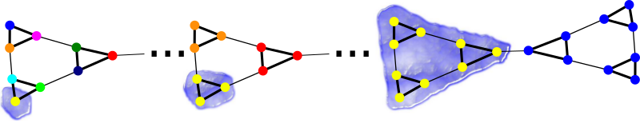

[](https://badge.fury.io/py/pygenstability)
[](https://codecov.io/gh/barahona-research-group/PyGenStability)
[](https://github.com/barahona-research-group/PyGenStability/actions)
[](https://github.com/psf/black)
[](https://barahona-research-group.github.io/PyGenStability/)
[](https://github.com/barahona-research-group/PyGenStability/blob/master/LICENSE)
[](https://zenodo.org/badge/latestdoi/183625721)


# *PyGenStability*

This ``python`` package is designed for multiscale community detection with Markov Stability (MS) analysis [1, 2] and allows researchers to identify robust network partitions at different resolutions. It implements several variants of the MS cost functions that are based on graph diffusion processes to explore the network (see illustration below). Whilst primarily built for MS, the internal architecture of *PyGenStability* has been designed to solve for a wide range of clustering cost functions since it is based on optimising the so-called generalized Markov Stability function [3]. To maximize the generalized Markov Stability cost function, *PyGenStability* provides a convenient ``python`` interface for ``C++`` implementations of Louvain [4] and Leiden [5] algorithms.
We further provide specific analysis tools to process and analyse the results from multiscale community detection, and to facilitate the autmatic selection of robust partitions [6]. *PyGenStability* is accompanied by a software paper that further details the implementation, result analysis, benchmarks and applications [7].



## Documentation

A documentation of all features of the *PyGenStability* is available here: https://barahona-research-group.github.io/PyGenStability/

## Installation


The wrapper uses Pybind11 https://github.com/pybind/pybind11 and the package can simply be installed by first cloning this repo with

```
git clone --recurse-submodules https://github.com/ImperialCollegeLondon/PyGenStability.git
```

(if the `--recurse-submodules` has not been used, just do `git submodule update --init --recursive` to fetch the submodule with M. Schaub's code). 

Then, to install the package, simply run
```
pip install . 
```
using a fresh `virtualenv` in python3 may be recommanded to avoid conflict of python packages. 

To use plotly for interacting plos in browser, install this package with 
```
pip install .[plotly]
```

To use contrib module, with additional tools, run
```
pip install .[contrib]
```

To install all dependencies, run
```
pip install .[all]
```

## Using the code

The code is simple to run with the default settings. We can import the run and plotting functions, input our graph (of type scipy.csgraph), and then plot the results in a summary figure presenting different partition quality measures across scales (values of MS cost function, number of communities, etc.) with indication of optimal scales.

```
from pygenstability import run, plotting
results = run(graph)
plotting.plot_scan(results)
```

Altough it is enforced in the code, it is advised to set environement variables
```
export OPENBLAS_NUM_THREADS=1
export OMP_NUM_THREADS=1
export NUMEXPR_MAX_THREADS=1
```
to ensure numpy does not use multi-threadings, which may class with the parallelisation and slow down the computation. 

There are a variety of further choices that user can make that will impact the partitioning, including:
- Constructor: Generalized Markov Stability requires the user to input a quality matrix and associated null models. We provide an object oriented module to write user-defined constructors for these objects, with several already implemented (see `pygenstability/constructors.py` for some classic examples).
- Generalized Markov Stability maximizers: To maximize the NP-hard optimal generalized Markov Stability we interface with two algorithms: (i) Louvain and (ii) Leiden.

While Louvain is defined as the default due to its familiarity within the research community, Leiden is known to produce better partitions and can be used by specifying the run function.

```
results = run(graph, method = "leiden")
```

There are also additional postprocessing and analysis functions, including:
- Plotting via matplotlib and plotly (interactive).
- Automated optimal scale selection.

Optimal scale selection [6] is performed by default with the run function but can be repeated with different parameters if needed, see `pygenstability/optimal_scales.py`. To reduce noise, e.g., one can increase the parameter values for `block_size` and `window_size`. The optimial network partitions can then be plotted given a NetworkX nx_graph.

```
from pygenstability import optimal_scales
results  = identify_optimal_scales(results, block_size = 10, window_size = 5)
plotting.plot_optimal_partitions(nx_graph, results)
```

## Constructors
 
We provide an object-oriented module for constructing quality matrices and null models in `pygenstability/constructors.py`. Various constructors are implemented for different types of graphs:

- `linearized` based on linearized MS for large undirected weighted graphs [2]
- `continuous_combinatorial` based on combinatorial Lablacian for undirected weighted graphs [2]
- `continuous_normalized` based on random-walk normalized Laplacians for undirected weighted graphs [2]
- `signed_modularity` based on signed modularity for large signed graphs [8]
- `signed_combinatorial` based on signed combinatorial Laplacian for signed graphs [3]
- `directed` based on random-walk Laplacian with teleportation for directed weighted graphs [2]
- `linearized_directed` based on random-walk Laplacian with teleportation for large  directed weighted graphs

For the computationally efficient analysis of **large** graphs we recommend using the `linearized`, `linearized_directed` or `signed_modularity` constructors instead of `continuous_combinatorial`, `continuous_normalized`, `directed` or `signed_combinatorial` that rely on the computation of matrix exponentials.

For those of you that wish to implement their own constructor, you will need to design a function with the following properties:

- take a scipy.csgraph `graph` and a float `time` as argument
- return a `quality_matrix` (sparse scipy matrix) and a `null_model` (multiples of two, in a numpy array)

## Contributers

- Alexis Arnaudon, GitHub: `arnaudon <https://github.com/arnaudon>`
- Robert Peach, GitHub: `peach-lucien <https://github.com/peach-lucien>`
- Dominik Schindler, GitHub: `d-schindler <https://github.com/d-schindler>`

We are always on the look out for individuals that are interested in contributing to this open-source project. Even if you are just using *PyGenStability* and made some minor updates, we would be interested in your input. 

## Cite

Please cite our paper if you use this code in your own work:

```
@article{pygenstability,
  author = {Arnaudon, Alexis and Schindler, Dominik J. and Peach, Robert L. and Gosztolai, Adam and Hodges, Maxwell and Schaub, Michael T. and Barahona, Mauricio},  
  title = {PyGenStability: Multiscale community detection with generalized Markov Stability},
  publisher = {arXiv},
  year = {2023},
  doi = {10.48550/ARXIV.2303.05385},
  url = {https://arxiv.org/abs/2303.05385}
}
```

The original paper for Markov Stability can also be cited as:

```
@article{delvenne2010stability,
  title={Stability of graph communities across time scales},
  author={Delvenne, J-C and Yaliraki, Sophia N and Barahona, Mauricio},
  journal={Proceedings of the national academy of sciences},
  volume={107},
  number={29},
  pages={12755--12760},
  year={2010},
  publisher={National Acad Sciences}
}
```


## Run example


In the `example` folder, a demo script with stochastic block model can be tried with 

```
python simple_example.py
```
or using the click app:
```
./run_simple_example.sh
```


Other examples can be found as jupyter-notebooks in the `examples/` directory, including:
* Example 1: Undirected SBM
* Example 2: Multiscale SBM
* Example 3: Directed networks
* Example 4: Custom constructors
* Example 5: Hypergraphs
* Example 6: Signed networks

Finally, we provide applications to real-world networks in the `examples/real_examples/` directory, including:
* Powergrid network
* Protein structures


## Our other available packages

If you are interested in trying our other packages, see the below list:
* [GDR](https://github.com/barahona-research-group/GDR) : Graph diffusion reclassification. A methodology for node classification using graph semi-supervised learning.
* [hcga](https://github.com/barahona-research-group/hcga) : Highly comparative graph analysis. A graph analysis toolbox that performs massive feature extraction from a set of graphs, and applies supervised classification methods.
* [MSC](https://github.com/barahona-research-group/MultiscaleCentrality) : MultiScale Centrality: A scale dependent metric of node centrality.
* [DynGDim](https://github.com/barahona-research-group/DynGDim) : Dynamic Graph Dimension: Computing the relative, local and global dimension of complex networks.
* [RMST](https://github.com/barahona-research-group/RMST) : Relaxed Minimum Spanning Tree: Computing the relaxed minimum spanning tree to sparsify networks whilst retaining dynamic structure.
* [StEP](https://github.com/barahona-research-group/StEP) :  Spatial-temporal Epidemiological Proximity: Characterising contact in disease outbreaks via a network model of spatial-temporal proximity.

## References

[1] J.-C. Delvenne, S. N. Yaliraki, and M. Barahona, ‘Stability of graph communities across time scales’, *Proceedings of the National Academy of Sciences*, vol. 107, no. 29, pp. 12755–12760, Jul. 2010, doi: 10.1073/pnas.0903215107.

[2] R. Lambiotte, J.-C. Delvenne, and M. Barahona, ‘Random Walks, Markov Processes and the Multiscale Modular Organization of Complex Networks’, *IEEE Trans. Netw. Sci. Eng.*, vol. 1, no. 2, pp. 76–90, Jul. 2014, doi: 10.1109/TNSE.2015.2391998.

[3] M. T. Schaub, J.-C. Delvenne, R. Lambiotte, and M. Barahona, ‘Multiscale dynamical embeddings of complex networks’, *Phys. Rev. E*, vol. 99, no. 6, Jun. 2019, doi: 10.1103/PhysRevE.99.062308.

[4] V. D. Blondel, J.-L. Guillaume, R. Lambiotte, and E. Lefebvre, ‘Fast unfolding of communities in large networks’, *J. Stat. Mech.*, vol. 2008, no. 10, Oct. 2008, doi: 10.1088/1742-5468/2008/10/p10008.

[5] V. A. Traag, L. Waltman, and N. J. van Eck, ‘From Louvain to Leiden: guaranteeing well-connected communities’, *Sci Rep*, vol. 9, no. 1, p. 5233, Mar. 2019, doi: 10.1038/s41598-019-41695-z.

[6] D. J. Schindler, J. Clarke, and M. Barahona, ‘Multiscale Mobility Patterns and the Restriction of Human Movement’, *arXiv:2201.06323 [physics.soc-ph]*, Jan. 2023, Available: https://arxiv.org/abs/2201.06323

[7] Preprint incoming ...

[8] Gómez, S., Jensen, P., & Arenas, A. (2009). ‘Analysis of community structure in            networks of correlated data‘. *Physical Review E*, 80(1), 016114.

## Licence

This program is free software: you can redistribute it and/or modify it under the terms of the GNU General Public License as published by the Free Software Foundation, either version 3 of the License, or (at your option) any later version.

This program is distributed in the hope that it will be useful, but WITHOUT ANY WARRANTY; without even the implied warranty of MERCHANTABILITY or FITNESS FOR A PARTICULAR PURPOSE. See the GNU General Public License for more details.

You should have received a copy of the GNU General Public License along with this program. If not, see http://www.gnu.org/licenses/.

